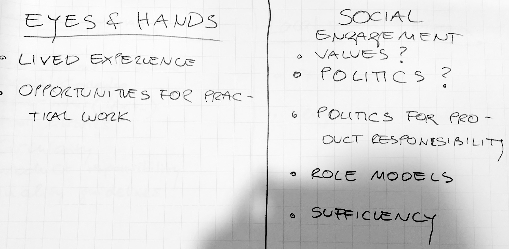
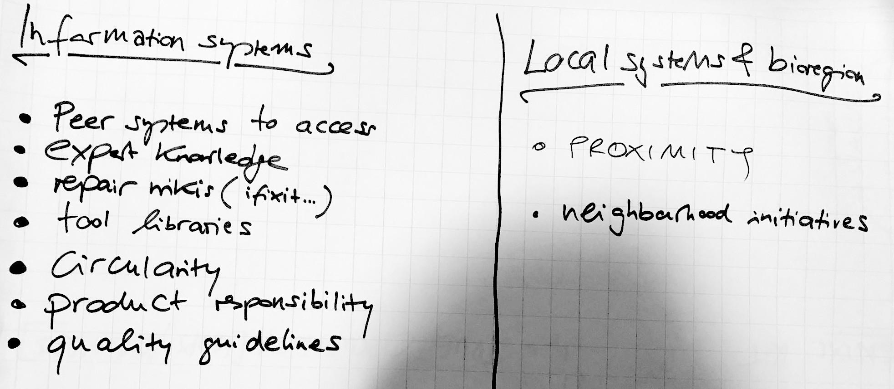
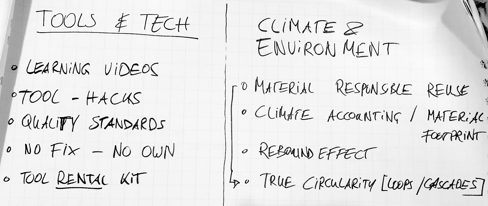
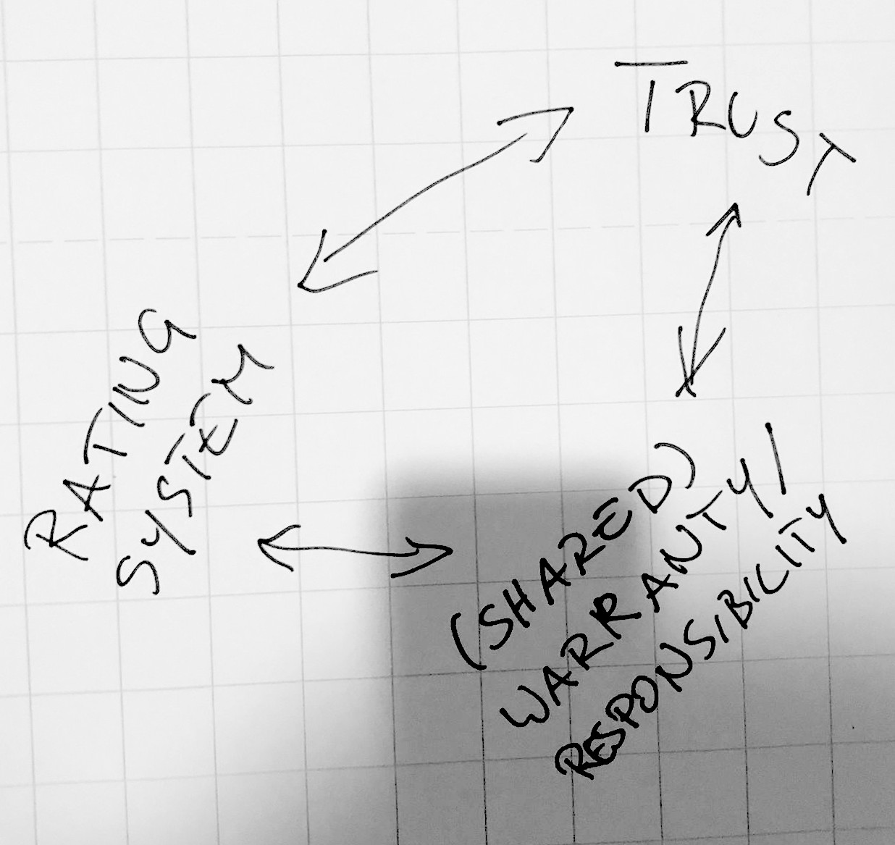
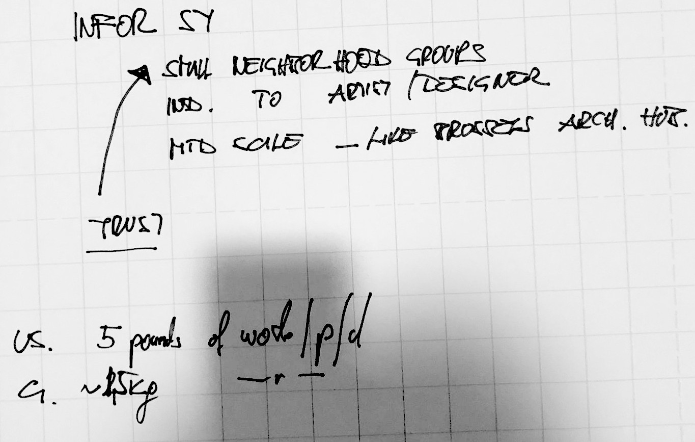
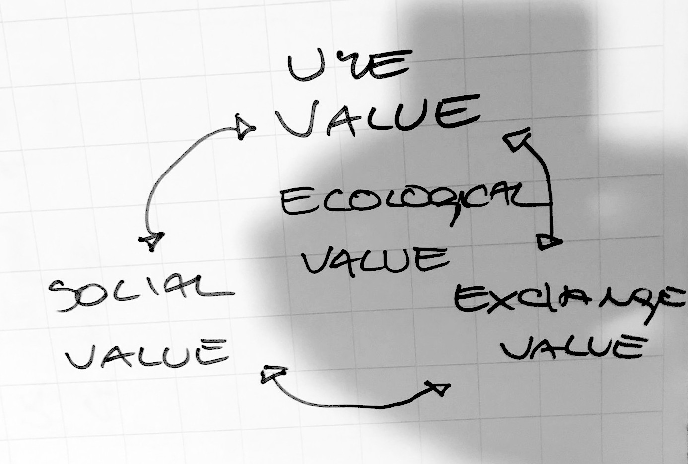

# Workshop at Kunst-Stoffe: "Circular Valuer Skills"

- **[Kunst-Stoffe](../Berlin/Kunst-Stoffe) – Zentralstelle für wiederverwendbare Materialien e.V.**
- Berliner Straße 17 13189 Berlin
- _Tuesday, July 22, 16h - 18h + quick tour of KS_

The in-person workshop was co-hosted by Felipe Schmidt Fonseca (GIG) and Corinna Vosse (Kunst-Stoffe). Janina Loof from GIG offered admin and organisational support.

**Special guests:** Jan-Micha Gamer, social designer; and Matthias Fritsch, carpenter.

Another 8 participants were present.

## Structure of the workshop

1. Introductions
2. Presentation - CMVC background
3. Open question to panelists
4. Group activity
5. Discussion and wrap

### 1. Introductions

The session started with a round of introductions. The participants were asked to state what brought them to the workshop and what was the last object they diverted from the waste stream.

Diverse profiles: consultants, architects, craftspeople, designers, technologists.

### 2. Presentation - CMVC background

_Slides available as a [PDF](CMVC_Workshop_Kunst-Stoffe_slides)._

- Critical take on the 'circular economy': Why are there no people in the butterfly diagram (besides users/consumers, which are but gears of an impersonal system)?
- Future outlook might be positive, at least in theory:
	- [EU Waste Framework Directive](https://environment.ec.europa.eu/topics/waste-and-recycling/waste-framework-directive_en)
	- [Circular Economy Action Plan](https://environment.ec.europa.eu/strategy/circular-economy-action-plan_en)
	- [Ecodesign for Sustainable Products Regulation](https://commission.europa.eu/energy-climate-change-environment/standards-tools-and-labels/products-labelling-rules-and-requirements/ecodesign-sustainable-products-regulation_en)
	- [Right to Repair](https://www.europarl.europa.eu/news/en/press-room/20240419IPR20590/right-to-repair-making-repair-easier-and-more-appealing-to-consumers)
- However, the present is bleak. Growing mountains of waste generated everyday, everywhere in the world.

### 3. Opening panel

Focus on the so-called "technical cycle" of the Circular Economy (regarding finite materials). There are many alternatives to waste management (recycling, incineration, landfilling):

- Share
- Maintain / Prolong
- Reuse/Redistribute
- Refurbish/Remanufacture

The questions that emerge are:

- _Who_ are the people who will share, maintain (and repair), prolong (and repurpose), reuse (and upcycle), redistribute, refurbish, remanufacture, recycle?
- How do they _learn_ how to perform those activities?
- How do they _organise_ their demands?

**Project hypothesis:** "circular material valuers". Reference from _agent valoriste_ in France. Is it a profession in itself or a role performed by other professionals?

_Corinna, Matthias and Jan-Micha were asked to comment._

**Notes from the discussion (by Felipe):**

- Attitude has to do with personal preferences + systemic observation.
- People who share values and want to avoid further exploitation of the planet through an extractivist mindset.
- Going beyond _shabby chic_.
- Values can be developed (or reinforced?) on early education.
- Issue of recognition by mainstream culture.
- In practice, those active in related fields come from informal education.
- Academic training helped developing methods.
- Organisation: need for more structured funding for businesses.
- Flexible structures, low fixed costs.
- Past project: [Roadmap to a Circular Society](https://www.hanssauerstiftung.de/roadmap/), also funded by Hans Sauer Stiftung.
- East Germany - collection places. Buy materials with pocket money, by volume or weight.
	- [SERO System](https://waste-move.eu/?p=1084&lang=en) (more [here](https://saxarchiv.hypotheses.org/30034) and [here](https://www.ddr.center/artikel/sero_recycling_in_der_ddr-aid_331.html)).
- Structure should be organised by the state. Coordinate with environmental goals.
- Control over material streams - holistic systems.
- People below poverty line are valuers. Who lives in the street needs to.
- [Nochmall](../Berlin/Nochmall) - select items. Strict: things that are valuable and can be resold. Discard a lot.
- Garments - 80% discarded. Systemic approach.
- Second loop.
- Second-hand works when there are proper conditions. Profit motive behind.
- Many local variables. Taxes.
- Organisation: entrepreneurism. Flexible types. 
- Talking to other people. Schools, workshops.
- German network of material initiatives.
- [Bauteilnetz](https://www.bauteilnetz.de/).
- Anglo-american approach: materials for schools.
- Repair cafes / open workshops ([Verbund Offene Werkstaetten](https://offene-werkstaetten.org/de)).
- Schrotthändler ("junkyards"?) - metal is expensive. People reselling copper.

### 4. Group activity

For the purposes of the workshop, participants were asked to temporarily leave aside broader considerations (consumerist culture, producer responsibility and EPRs, incentive systems, accounting for externalities) and focus on a proposed set of knowledge areas to be covered on a curriculum tor material valuer education:

- Eyes and Hands
- Information Systems
- Tools and Technology
- Local Systems and Bioregion
- Social Engagement
- Climate and Environment

The participants formed two groups to discuss the first three areas, then the other three, and document their discussion on flipchart pages. Photos are below.

**Quick note by Felipe:**

- Additional link to one of the groups, after mention of Jugaad: [DIY in Context From Bricolage to Jugaad](https://www.scribd.com/document/98988556/DIY-in-Context-From-Bricolage-to-Jugaad) by Victor Viña.

### 5. Final discussion

All the participants reassembled for final considerations after the group activity. They were prompted to reflect on:

- Intrinsic motivations
- Educational approaches
- Business models
- Context adaptability
- Materials and categories - are they universal?
- Modular training
- References
- Exchange
- Educate the public

**Notes from the discussion (Felipe):**

- Practical experience with material reuse
- Difficult to relate with those knowledge areas - where to pin things down
- Curiously hard to respond to what appears to be simple questions - who whould be doing these things? How do they learn? How do they sustain their activities?
- Missing elements:
	- Values
	- Politics
	- _Why does society keep doing wrong things?_
- Overuse / overshoot day
- So many steps to undo
- Universal bearer of material knowledge
- Use value / exchange value (Marx)?
	- But also: _social value_.
	- Collective view of value of things.
- Neighbourhoods. Community value. Share srouces.
- People want to bring more stuff.
- Salesperson won't learn:
	- Tactile skills
	- Curiosity
	- Imagination
	- _Youngsters are getting worse and worse on those._

---

## Original Workshop Invitation

https://www.eventbrite.com/e/workshop-circular-valuer-skills-tickets-1483429400269

Are you passionate about circularity, material reuse, and upcycling? Do you want to contribute to a more sustainable future?

Join the Global Innovation Gathering (GIG), Reuse City and Kunst-Stoffe for a collaborative workshop focused on the Circular Material Valuer project!

**About the Project**

The Circular Material Valuer is a citizen science initiative exploring the crucial skills and knowledge needed to extend the lifespan of goods. By focusing on repairing, upcycling, adapting, and recirculating materials, we can divert valuable resources from waste streams.

This workshop is a unique opportunity to directly contribute to the development of the Circular Material Valuer Curriculum, an open-source educational resource designed to empower individuals and communities in the circular economy.

Learn more about the project here:

https://wiki.reuse.city/en/projects/circular-valuer-curriculum

**What to Expect**

- Collaborative Sessions: Engage in hands-on activities and discussions that will directly shape the curriculum's content and structure.
- Networking: Connect with like-minded individuals, including designers, educators, activists, and enthusiasts from the circular economy, zero-waste, and upcycling communities.
- Direct Impact: Your insights will play a vital role in building this publicly available, impactful resource.

**Who Should Attend?**

This workshop is open to everyone interested in making a difference in material circularity. Whether you're a seasoned expert or just starting your journey in sustainable practices, your perspective is highly valued!

**Your Contribution & Recognition**

All workshop outputs will be shared with participants. Selected contributions will be incorporated into the Circular Material Valuer Curriculum, and you'll have the option to be credited as a contributor on all public project documentation released under open licenses.
